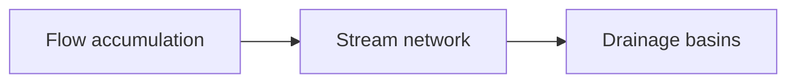

# Path of steepest descent 

*Digital elevation models* - or **DEM** are incredibly useful. DEM are [raster](QGIS_Intro.md#Raster-data) datasets containing an elevation value at each pixel, which capture the morphology of the Earth's surface. Global DEM datasets such as [SRTM](https://www2.jpl.nasa.gov/srtm/) or [ASTER](https://earthdata.nasa.gov/learn/articles/new-aster-gdem) are usually produced from the ISS or satellite imagery, but higher-definition datasets can be produced from airborne [LiDAR](https://www.swisstopo.admin.ch/en/knowledge-facts/geoinformation/lidar-data.html) missions or structure-from-motion from [UAVs](https://eos.org/science-updates/drone-peers-into-open-volcanic-vents). Here, we will use a DEM with a resolution of 25 m covering the island of La Palma created by the Cartográfica de Canarias, GRAFCAN (updated the 4 February 2021, available at https://opendata.sitcan.es/).

Using *only* a DEM, hydrological analyses can help establishing a surface water system model that we can use to constrain *some* surface hydrological processes, including **likely flow direction** or **drainage basins**. It is therefore extensively used in land-use planning to estimate potentially flooding areas, or to design proposed drainage systems and facilities. Since lava flows are confined by topography, flow paths can be broadly predicted from DEM once the vent location is identified. Here, we will use this workflow to get a general idea of the possible lava flow paths in La Palma:

Several softwares propose implementations of hydrological analyses including [QGIS](https://docs.qgis.org/3.22/en/docs/training_manual/processing/hydro.html?highlight=hydrological), [Matlab](https://topotoolbox.wordpress.com) and [ArcGIS](https://desktop.arcgis.com/en/arcmap/latest/tools/spatial-analyst-toolbox/an-overview-of-the-hydrology-tools.htm). Here, we have pre-computed the important datasets for you, which are contained in the `Hydrology` group in the *Layer Panel*. 

## :material-format-list-checks:{ .icn } Objectives 

- Understand the value of DEM datasets to extract a surface water runoff model.
- Explore the use of hydrological analyses for lava flow hazard assessment.
- Understand the benefits and limitations of this approach.

## :fontawesome-solid-gears:{ .icn } Theory

### Flow accumulation

Start by showing only the `Flow Accumulation (log)` layer in `QGIS`. Conceptually, the `Flow Accumulation` raster represents the **cumulative number of upstream pixels that contribute to surface water drainage to any given downstream pixel**. Starting from a DEM, the algorithm:

1. Assumes that water at a given pixel will flow towards the adjacent pixel that shows the greatest $-\Delta z$ to estimate the flow directions.   
2. Once flow direction is estimated, the algorithm counts **how many upstream** pixels contribute to any given **downstream** pixel.

!!! tip "Do it yourself!"

    1. Starting from this DEM, can you estimate the most likely flow direction and the flow accumulation values?

    <figure markdown>
    { width="400" }
    </figure>

??? check "Flow accumulation"

    - **Pink lines** show flow *direction*.
    - The **blue gradient** shows flow *accumulation* &rarr; darker shades of blue indicate the contribution from *more pixels*.
  
    <figure markdown>
    { width="400" }
    </figure>

- Look at the `Flow Accumulation (log)` layer in `QGIS`. For a better visual rendering, this layer shows the `log10` of the number of contributing pixels. 
- Analyse the dataset in perspective of the underlying DEM. Does it make sense? (Spoiler alert: it does!)

### Stream network

Now turn on the `Stream network` layer in `QGIS`.  `Stream network` algorithm simply applies a threshold of count values $c$ to the `Flow Accumulation` raster to delineate a *stream*. If a given pixel has a number of contributing pixels $C$ such as $C \geq c$, then the pixel is assumed to be part of the stream. Think of the `Stream network` information as a higher-level version of the `Flow Accumulation` raster. As a matter of fact, `Stream network` is another word for **path of steepest descent**. 

!!! check "Stream network"

    From the same DEM as before, this is how the **path of steepest descent** would look: 

    <figure markdown>
    { width="400" }
    </figure>

!!! warning "Threshold value"

    Note that there is no universal value for $c$: it depends on such aspects as the *maturity* of the drainage system, the *scale* of the analysis or the *resolution* of the DEM. It should therefore be explored on a case-per-case basis. 

### Drainage basin

Turn on the `Drainage basin` layer in `QGIS`: this raster now classifies **which stream each pixel contributes to**. Think of it as a **watershed**, where *ridges* act as limits between zone contributing to different streams and *valleys* accumulate most of the surface flow. Validate that by observing the `Drainage basin` layer in perspective of the underlying topography.

!!! check "Drainage basin"

    It is now possible to estimate *where* water on each pixel will go.
    
    <figure markdown>
    { width="400" }
    </figure>
    
!!! question "Question 1: Drainage system"

    You can observe a large discrepancy in the **area** and the **shape** of the various drainage basins.

    1. How do they spatially vary over the island?
    2. How do they relate to the underlying topography? 

## :material-head-flash:{ .icn } Exercise 

### Historical lava flows 

Let's now place this data in the context of a hazard assessment. Start by downloading the <a href="../files/GeologicalmapofLaPalma.pdf", target="_blank">geological map of La Palma</a> by [Carracedo et al., (2001)](https://www.researchgate.net/publication/233747095_Geological_map_of_La_Palma_Canary_Islands) and spend some time looking at it.

!!! question "Question 2: Historical lava flows"

    1. Can you spot where historical lava flows occurred?
    2. Are they originating from *a single* or *multiple* vents?
    3. In historical times, what part of the island has been most affected by lava flows?
    4. How do the directions of past flow match predictions from hydrological modeling?

??? info "Monogenetic vs polygenetic volcanism"

    La Palma is a *composite* volcano. As you can see both from the DEM and the geological map, the currently most active southern part contains several *monogenetic* vents. Monogenetic vents are typically active during *a single eruptive event* and not reactivated afterwards. The opening of a new vent is then controlled by several parameters (e.g., tectonic regime[^1]), and predicting the spatial likelihood of vent opening is an additional complexity for long-term hazard and risk assessments in monogenetic fields. This is especially the case for Auckland, which is built on a monogenetic field[^2]. 

    Here are some definitions of volcanic landforms[^3]:

    **Composite volcanoes**
    > All conical or broadly conical polygenetic volcanoes constructed of accumulations of lava and pyroclastic deposits, sometimes alternating, erupted from vent(s) located at the summit (eruptions can also on occasion occur from the flanks) of the volcano.

    **Monogenetic vents**
    > Discrete minor volcanic landform that forms during one eruptive cycle. Can be mafic (cinder or scoria cones, maars, diatremes, tuff cones, tuff rings, and scutulum shields) or silicic (lava domes and coule es) in composition. Typical lifetimes of years to decades for mafic centers, decades to centuries for silicic ones.

    **Polygenetic vents**
    > Large discrete volcanic landform that forms during several episodic eruptive cycles. Typical lifetimes of $10^4-10^5$ years. Can be mafic or silicic in composition. Most common types are composite volcanoes and shield volcanoes.

### Probability of vent opening 

As we will discuss throughout the exercices, assessing *where* the next monogenetic vent will open is a difficult process. In their paper, Marrero et al. (2019)[^4], used a random model to represent the complexity of the spatial distribution of vent location that the monogenetic volcanic activity can produce. The resulting vents are shown in Figure 1. This is a discussable choice, and you are invited to refer to the original paper for their motivations. In any case, one assumption behind this approach is that all vents shown in Figure 1 have an **equal probability of occurrence**. 

<figure markdown>
  { width="300" }
  <figcaption>Figure 1: Possible location of vent opening for the next eruption according to Marrero et al. (2019).</figcaption>
</figure>

!!! question "Question 3: Vent opening"

    1. If all vents in Figure 1 have an **equal probability of occurrence**, does that mean that the entire island is uniformly exposed to lava flow inundation? 
    2. What parts of the island are most exposed to lava flow inundation?
    3. Are there any safe/shadow parts?

### The 2021 eruption 

The 2021 eruption of Cumbre Vieja started on September 19 and lasted until December. During this period, multiple vents opened, some producing tephra whilst other produced compound lava flows that reached the sea. In `QGIS`, the `2021 Eruption` layer group shows you both the vents and the chronology of lava flows provided by the [Copernicus Emergency Management Service](https://emergency.copernicus.eu/mapping/list-of-components/EMSR546) (CEMS). 

!!! info "Identify feature tool"
    By using the `Identify Feature` tool in the [Toolbar](QGIS_Intro.md#the-qgis-interface), you can click on any lava flow outline and see its properties in the `Identify results` panel. Check the `date` field.
    {width=40, align=left }

Using the lava flow outlines, we computed the evolution of **flow length** and **flow width** through time as shown in Figure 2.

!!! question "Question 4: Evolution of the flow field"

    Using the flow outlines in `QGIS` and Figure 2, estimate:

    1. How accurate would have been the **steepest descent** approach to *forecast* flow inundation of the 2021 eruption? How different is the actual flow compared to the drainage network?
    2. How dynamic is a months-long lava flow? Is it a *single* event or a compound *pulsatory* phenomena?
    3. What event do you think corresponds to the dashed red line in Figure 2? What happens *before* and *after*?
    4. What are the *advance* and *widening* rates of the 2021 lava flow? Can you use it to estimate the advance and widening of possible lava flows from other vents?

<figure markdown>
  
  <figcaption>Figure 2: Advance and widening rates of the 2021 lava flow.</figcaption>
</figure>

## :material-thought-bubble:{ .icn } Food for thoughts 

Comparing the path of steepest descent approach computed on the pre-2021 eruption topography with the actual outlines of the lava flows of the 2021 eruption shows how:

- The path of steepest descent captures the general trend of flow direction **but**
- The actual flow significantly diverted from this initial prediction.

!!! hint "Limitations"

    Spend some time thinking about the *reasons* behind this discrepancy, including:

    1. The rheological properties of the lava flows.
    2. Their duration, the properties of *single* vs *compound* lava flows and their evolution in time.
    3. Their relation with topography.

From a crisis management perspective and reflecting back on the [Kīlauea crises](Hazard_lava_intro.md#objectives), the **path of steepest descent** is a great communication tool for as long as:

- There is an active monitoring of the crisis as it evolves.
- There is a clear and trusting communication channel between the monitoring agencies and the stakeholders, thanks to which limitations and uncertainties associated with predictions can be clearly explained and discussed.

However, its **deterministic** nature prevents its ability to systematically account for uncertainties. In a way, it only shows the **most likely** scenario rather than exploring a **range of possible** scenarios. Therefore, the **path of steepest descent** approach is not suited for long-term hazard and risk studies, which are required for such tasks as land-use planning and the pro-active development of other risk-reduction strategies. In the next exercise, we will use a stochastic model to address some of these shortcomings and test it on La Palma.

## :material-check-bold:{ .icn } Summary

In this exercise, we:

- Used hydrological modeling tools to obtain a first-order estimate of the possible extent of lava flow inundation. 
- Compared this approach with historical and recent lava flows at La Palma. 
- Discussed its limitations and its domain of applicability.

## :fontawesome-solid-book:{ .icn } References

[^1]: Gallant, E., Cole, L., Connor, C.B., Donovan, A., Molisee, D., Morin, J., Walshe, R., Wetmore, P., 2021. Modelling eruptive event sources in distributed volcanic fields 4, 19. http://jvolcanica.org/ojs/index.php/volcanica/article/view/119
[^2]: Deligne, N.I., Fitzgerald, R.H., Blake, D.M., Davies, A.J., Hayes, J.L., Stewart, C., Wilson, G., Wilson, T.M., Castelino, R., Kennedy, B.M., Muspratt, S., Woods, R., 2017. Investigating the consequences of urban volcanism using a scenario approach I: Development and application of a hypothetical eruption in the Auckland Volcanic Field, New Zealand. Journal of Volcanology and Geothermal Research 336, 192–208. https://doi.org/10.1016/j.jvolgeores.2017.02.023
[^3]: de Silva, S., Lindsay, J.M., 2015. Chapter 15 – Primary Volcanic Landforms, in: The Encyclopedia of Volcanoes. pp. 273–297. https://doi.org/10.1016/B978-0-12-385938-9.00015-8
[^4]: Marrero, J.M., García, A., Berrocoso, M., Llinares, Á., Rodríguez-Losada, A., Ortiz, R., 2019. Strategies for the development of volcanic hazard maps in monogenetic volcanic fields: the example of La Palma (Canary Islands). J Appl. Volcanol. 8, 6. https://doi.org/10.1186/s13617-019-0085-5

*[ESP]: Eruption source parameter &rarr; most important initial conditions to a model
*[TGSD]: Total grain-size distribution
*[MER]: Mass eruption rate
*[VEI]: Volcanic explosivity index
*[HIM]: Hazard impact metrics
*[GAR]: Global assessment report
*[DDS]: Damage-Disruption states &rarr; one way of characterising vulnerability
*[GVP]: Global volcanism program 
*[GSD]: Grain size distribution
*[DEM]: Digital Elevation Model