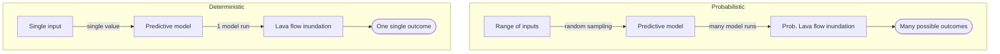

# Probabilistic modelling: Part 1

Attempting to predict the behaviour of *future* hazardous events is inherently associated with **uncertainties**. We will never be able to predict **exactly** what will happen in the future, so we need to use a modeling framework that allows for uncertainty quantifications. This is where **probabilistic modeling** enters the show. Probabilistic modeling allows exploring *a range* of possible future outcomes rather than a a unique realisation.

## Probabilistic modelling

Let's go back to the fictional DEM used in the [previous exercise](Hazard_lava_steepest-descent.md#flow-accumulation). As we saw from [existing literature](Hazard_lava_steepest-descent.md#probability-of-vent-opening), monogenetic field such as La Palma imply that future eruptive event will take place from a new vent. Imagine that all the red pixels in Figure 1 represent coordinates where the next vent can potentially open. How do we account for the **uncertainty associated with vent location** when quantifying the hazard of a future eruption?

<figure markdown>
  { width="400" }
  <figcaption>Figure 1: Fictional DEM with locations of possible future vent opening indicated in red.</figcaption>
</figure>

The idea here is that we will not model **only one realisation of an event** - here a one lava flow originating from a single location - but **many**, and that we will **average** all their contributions. Unlike what we saw when using the [path of steepest descent](Hazard_lava_steepest-descent.md#flow-accumulation), we will assess the flow trajectory initiating from all pixels in Figure 1.

<figure markdown>
  { width="400" }
  <figcaption>Figure 2: Combination of the paths of steepest descent estimated from all pixels of Figure 1.</figcaption>
</figure>

Figure 2 shows the overlay of the path of steepest descent computed from each of the 6 pixels identified in Figure 1. **What do we see?**

- Some pixels in Figure 2 are inundated regardless of the initialisation point (&rarr; darker shades of pink).
- Conversely, other pixels are inundated only for selected inundation points (&rarr; lighter shades of pink).

Therefore, darker pixels have **higher probabilities of inundation** than others. Using a *frequentist* approach, we can calculate the **probability** $P(x,y)$ of a pixel to be inundated by counting *how many times* a pixel is hit and normalising this count by the total number of runs, where $x$ and $y$ are the pixel's coordinates:

$$
P(x,y) = \frac{\sum_{i=1}^{N_{r}}n_{i}}{N_{r}}
$$

Where $N_{r}$ is the total number of runs and $n_{i}$ is defined as:

$$
n_{i} = \bigg\{ ^{1,\ if\ inundation} _{0,\ otherwise}
$$

<figure markdown>
  { width="400" }
  <figcaption>Figure 3: Computing the probability of inundation using a frequentist approach.</figcaption>
</figure>

So, from Figures 2 and 3:

- A pixel hit *once* ($n_{i} = 1$) over the six simulations ($N_{r} = 6$) has a probability $P(x,y) = \frac{1}{6} = 0.17$ (or 17%).
- A pixel hit *twice* ($n_{i} = 2$) over the six simulations has a probability $P(x,y) = \frac{2}{6} = 0.33$ (or 33%).

## Deterministic vs probabilistic modeling 

This modeling approach contrasts with **deterministic** modeling strategies. In deterministic modeling, the user choses **one** value for each model input, runs **a single instance** of the model that will compute a **single realisation**, in our case the extent of lava flow inundation. With **probabilistic** modeling, the aim is to explore how **variability of input parameters** will impact hazard predictions in order to represent a *probability* of hazard occurrence. This flowchart contrasts both modelling philosophies:

!!! info "Gambling-driven science"

    This type of random sampling is often referred to as **Monte Carlo** simulations. This name comes from the Monte Carlo casino in Monaco, where a lot of probability theories were developed around gambling. **Stochastic sampling** is also a synonym of random sampling.

Ultimately, there are 3 main approaches for volcanic hazard assessments.
