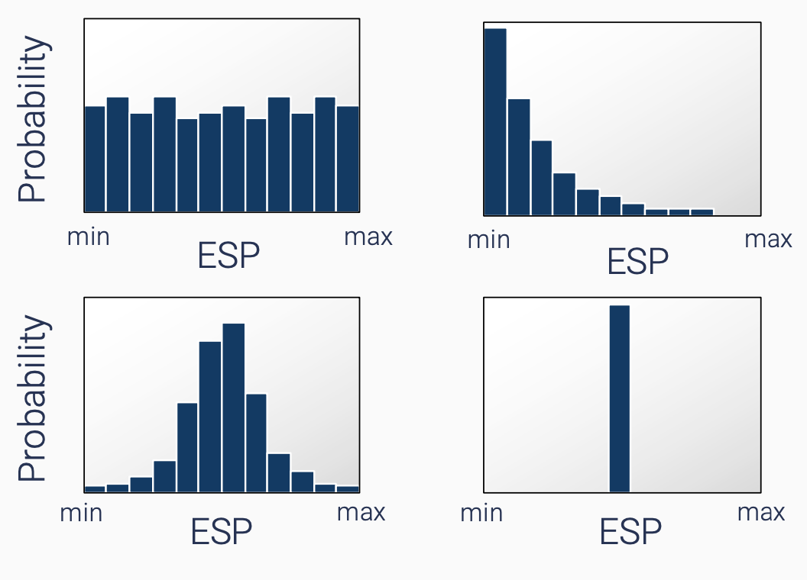

# Probabilistic modelling: Part 2

## Probabilistic modeling workflow 

From now on, we will refer to model inputs as **Eruption Source Parameters** - or **ESP**. Probabilistic modeling requires one to:

1. Identify relevant ESPs for a problem.
2. Estimate the uncertainty on each ESP.

## Identify relevant ESPs 

The first aspect to identify is **what ESP is critical** for the hazardous phenomenon of interest. For instance, important ESP for tephra accumulation include the plume height, the erupted mass, the mass eruption rate and the grain-size distribution. 

The choice of ESP must be put in context of the **selected model** for hazard assessment. Typically, **complex numerical models** are very **accurate** but require a **large number of ESPs**, which can be difficult to obtain. For instance, `FLOWGO` is a model that simulates lava flows based on the evolution of thermo-rheological properties that requires the identification of tens of different ESPs. Conversely, **simpler models** rely on simpler assumptions, usually require **less ESPs** but typically have a lower accuracy. The `path of steepest descent` approach is an illustration of such models, and relies only on a **single** input parameter that is the DEM. 

!!! info "What model is better"

    Is a **complex numerical model** always better than a **simpler model** (e.g., empirical)? Well, not necessarily, it all depends on **context**.

    When a high accuracy is required, complex numerical models are generally better. However, they usually require a large number of ESPs and an important computing power. Therefore, they are not suited for probabilistic analyses as their computational time is too large, and they are therefore mostly used for **deterministic** modeling. 

    Conversely, simpler models might not capture all the subtleties of the underlying processes, but are easier to use and require less computation cost. Therefore, they can be used for **probabilistic** modeling and are often used for long-term hazard assessments. 

## Estimate the uncertainty of ESPs 

Probabilistic modeling requires to define ESPs not as **single** but as **distributions** of values, generally defined as:

1. A **range** of values (i.e., the `minimum` and `maximum` values to explore).
2. A **shape** of distribution. 

These two components reflects the **knowledge** that we, as "experts", have of the problem. Figure 4 illustrates 4 types of uncertainty distributions that can be applied to ESPs:

- The **top left** scenario is a `uniform` distribution: In this case, any value between `min` and `max` has an **equal probability of occurrence**. This is often referred to as a *maximum level of ignorance*. 
- The **top right** scenario is a `logarithmic` distribution: In this case, we assume that **smaller values** have higher probabilities of occurrence **than larger** ones. For instance, large earthquakes occur more often than small ones. 
- The **bottom left** scenario is a `gaussian` distribution: Here we assume that **a central value** has the highest probability of occurrence, but it can divert from it in a **symmetrical** fashion.
- Finally, the **bottom right** scenario represent an unrealistic case where `min`=`max`. This would only occur if there was **no uncertainty**.

<figure markdown>
  { width="600" }
  <figcaption>Figure 4: Various approaches to quantify ESP uncertainties during probabilistic modeling.</figcaption>
</figure>

!!! info "What uncertainty"

    Conceptually, uncertainties can be classified in two categories:

    - **Epistemic uncertainty**  derives from the lack of knowledge regarding a phenomena. In theory, we could reduce epistemic uncertainties if more observations of the phenomena were available to help us better constrain the underlying processes and behaviours.
    - **Aleatoric uncertainty** is associated with the inherent randomness of natural processes. 

    The types of distributions shown in Figure 4 combine both types of uncertainties. Although a better characterisation of the **epistemic** uncertainty would help to refine the *top left* distribution towards a distribution centered on a *best guess* values, the constant presence of an **aleatoric** component of uncertainty is the reason why the *bottom right* distribution is impossible to achieve.

**How do we improve our knowledge of the uncertainties around ESPs?** Ideally, identifying the range of ESPs is based on **extensive field studies**. By reconstructing the **stratigraphy** of a volcanic edifice, we can study its **past eruptive history**, which is then used to estimate the potential future **eruption scenarios**. 