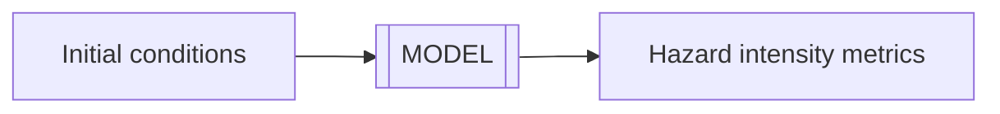

# Modeling tephra dispersal

Until now, we have used a *probabilistic* model to [simulate lava flow inundation](Hazard_lava_Q-LavHA.md), using models that consider limited to no physics. In contrast, most models for **tephra dispersal and deposition** require a *physics-based* approach to assess associated hazards. 

This module introduces the modelling strategy that will be adopted throughout the following exercises, which relies on `Tephra2` and `TephraProb`.

## :material-format-list-checks:{ .icn } Objectives

- Understand the large-scale physical processes controlling tephra dispersal modeling. 
- Review various modeling strategies, their purposes, benefits and limitations.
- Introduce the concept of **eruption source parameters**.

## :fontawesome-solid-gears:{ .icn } Modeling tephra dispersal 

**Models** are approximation of reality. In the case of natural hazards, a useful model must be able to estimate the spatial and temporal distribution of **hazard intensity metrics** as a function of **initial contitions**:

For instance, a simple **flood** model might attempt to estimate the **inundated area** (&rarr;HIM) as a function of **rainfall** and the **watershed** properties (&rarr;initial conditions). 

**Models** can be classified in two main categories:

- **Physical** models rely on a simplified formulation of physical laws.
- **Mathematical** models are data-driven and namely include statistical or machine learning-powered models. `Q-LavHA` falls in this category.

This part of the module focuses on the use of a **physical** model.

### Model parametrisation 

A physical model is a **parametrisation** of natural processes, which means that the physics behind a phenomenon is described by a set of equations that we could theoretically solve with the right **input parameters**. For instance, accurately describing **tephra transport and deposition** requires to account for the following aspects:

- The generation of volcanic particles.
- The ejection of volcanic pyroclasts in the atmosphere (&rarr; the vertical *column*).
- The dispersal of this material by the wind in the atmosphere (&rarr; the "mushroom" horizontal *plume*).
- The sedimentation of particles onto the ground (&rarr; the tephra *deposit*).

There is no **unique way** of solving this problem. Depending on the **assumptions** behind the physical processes and the **purpose** of the model, the governing equations can be posed in a more or less complex way. 

This slideshow summarises the various steps that tephra transport and deposition models have to solve:

=== "Exsolution" 

    

    - Volatiles (&rarr; gases) dissolved in the magma starts to escape.
    - As a result, the liquid magma starts rising in the conduit.

=== "Fragmentation"

    

    - The liquid accelerates upwards, the rate of deformation becomes critical and the liquid starts behaving like a solid.
    - The magma becomes *brittle* and fragments: it is now a cloud of *solid* (&rarr; pyroclasts) particles surrounded by gas.

=== "Convection"

    

    - The material reaches the atmosphere with sufficient momentum to entrain surrounding air.
    - The plume becomes *lighter* than the atmosphere and rises from *buoyancy* forces.

=== "Wind advection"

    

    - After entraining sufficient air, the plume reaches the same *density* as the atmosphere (&rarr; level of neutral buoyancy).
    - The *umbrella cloud* develops and elongates in the direction of the wind.

=== "Tephra sedimentation"

    

    - Particles are carried horizontally in the umbrella cloud. As it evolves away from the source, it becomes less "strong" and is not able to transport particles.
    - Large particles leave the umbrella cloud first and fall close to the vent, while finer particles are carried farther away, creating the **tephra deposit**.

!!! warning "Strong plumes"

    These cartoons assume a **strong plume** with a typical mushroom-shaped morphology. However, keep in mind that other types of **transitional** or **weak** plumes exist. If the vertical rate of ascent of the plume is not sufficiently high, the plume can *collapse* and create **pyrocalstic density currents**.

### Modeling choices

Some models attempt solving all physical processes taking place in time and space. These models are complex and (theoretically) have a higher accuracy. However, their use is often impeded by:

- The large number of input parameters required to solve all the physics.
- The high computational time required to run them.

Alternatively, other models adopt *assumptions* that allows them to simplify some physical processes. Although their (again, theoretical) accuracy is lower, these models:

- Require less input parameters, which facilitates their use.
- Are faster to run as they do not need to solve as many equations.

!!! info "What model is better for hazard assessment?"

    Is a **complex numerical model** always better than a **simpler model** (e.g., empirical or probabilistic)? Well, not necessarily, it all depends on **context**.

    When a high accuracy is required, complex numerical models are generally better. However, they usually require a large number of input parameters and an important computing power. Therefore, they are not suited for probabilistic analyses as their computational time is too large, and they are therefore mostly used for [deterministic](Hazard_probabilistic1.md) modeling. 

    Conversely, simpler models might not capture all the subtleties of the underlying processes, but are easier to use and require less computation cost. Therefore, they can be used for [probabilistic](Hazard_probabilistic1.md) modeling and are often used for long-term hazard assessments. 

### The Tephra2 model

In order to assess the hazard associated with tephra accumulation, we will here use the `Tephra2` model[^1]. `Tephra2` uses an *analytical solution to the advection-diffusion equation*. In other words:

- `Tephra2` simplifies the *atmospheric transport* of particles, thanks to which the *tephra accumulation* can be computed rapidly.
- *Numerous* of input parameters related to atmospheric transport are *parametrised* into *a few* parameters.
- *Computation time* is fast.

These specificities make `Tephra2` **highly suited** for [probabilistic hazard assessment](Hazard_probabilistic1.md) purposes.

`Tephra2` requires three different inputs (Figure 1):

- A `computation grid` &rarr; the **spatial resolution** of `Tephra2` outputs is set by the grid resolution. A *coarse* grid will result in longer computation time than a *fine* one.
- `Wind` conditions during the eruption &rarr; specifically wind *direction* ($^{\circ}$) and *speed* ($m/s$).
- `Eruption source parameters` &rarr; initial eruption conditions to the model.

<figure markdown>
{width='450px'}
<figcaption>Figure 1: Input parameters required by Tephra2 </figcaption>
</figure>

!!! info "Other models"

    The design of `Tephra2` prevents it to compute **atmospheric concentration**, for which 3D models are usually required. Such models include **Ash3D**, which can be used as an [online tool](https://vsc-ash.wr.usgs.gov/ash3d-gui/#!/) after registration, or **Fall3D**, available [here](https://gitlab.com/fall3d-distribution).

### Eruption source parameters

Let's introduce an important concept that we will use throughout the exercise: **Eruption source parameter** or **ESP**:

!!! important "Eruption source parameters"

    ESP are the initial conditions required by a given model to describe specific physical processes.

*ESP* are therefore synonyms of *initial conditions*. **Why a different name then?**

<!-- This table summarises the main ESP required in `Tephra2`: -->
Let's look at the main ESP required by `Tephra2`:

| ESP | Description |
|:---|:---|
| `mass` | Total tephra mass erupted during the eruption, in $kg$. |
| `height`  | Plume height, in $km$. |
| `TGSD`   | Total grain-size distribution (TGSD) &rarr; controls the content in *coarse* vs *fine* particles, in $\phi$ units &rarr;$=-log_2(diam.\ [mm])$. |
| `MER` | Indirectly used in `Tephra2`, the mass eruption rate (MER; $kg/m^2$) is estimated from `height` and `wind speed`. |

!!! question "Do you notice anything?"
    &rarr; All these EPS are quantities that can be directly measured in the field!

Therefore, we, as Physical volcanologists/Geologists/Earth Scientists, can directly translate **geological information** into **model inputs** in the perspective of our knowledge of the underlying processes. Thanks to that, we prevent **over-fitting** our model (i.e., tuning initial conditions to fit a desired output) or using a **black-box** approach.

## :material-thought-bubble:{ .icn } Food for thoughts 

Many different models for tephra dispersal and deposition exist, some of which can be found [here](resources.md), or in the report of the 2021 Ash and Aviation Workshop [report](https://www.unige.ch/sciences/terre/CERG-C/international-conferences/workshop/results/). It is again important to chose the appropriate model for a **given context**.

For instance, `Tephra2` is suited for probabilistic hazard analyses, but being time-independent, it cannot capture the **spatio-temporal evolution** of the ash cloud. It is therefore more suited for *preparedness* rather than *crisis management*.

Conversely, `Fall3D`[^2] is a 3D, time-dependent model that is able to describe the evolution of the ash cloud in 4D. Its computational costs limits its probabilistic applications, but it is suited to monitor the evolution of a crisis in near-real time.

As a result, the same remarks as those made for lava flow models hold for tephra hazard assessment: It is important to understand the benefit and limitations of each model in order to choose the most appropriate one.

Similarly, various models will require different **types of ESP**, some of which can be directly estimated from field studies, others that require additional laboratory analyses or plain guessing. Here, we use the `Tephra2` model as its main ESPs can be estimated in the field. In the next section, we will look at how to turn **ESP** into **eruption scenarios**.

## :material-check-bold:{ .icn } Summary

This section provided an introduction to the modeling of tephra dispersal and deposition. We reviewed:

- [x] The main physical volcanology aspects involved in the problem.
- [x] Various modeling approaches available to solve it.
- [x] Introduced `Tephra2` and its critical ESP.

In the next section, we will look at the philosophy behind using `Tephra2` for probabilistic hazard modelling.

## :fontawesome-solid-book:{ .icn } References 

[^1]: Bonadonna, C., Connor, C.B., Houghton, B.F., Connor, L., Byrne, M., Laing, A., Hincks, T.K., 2005. Probabilistic modeling of tephra dispersal: Hazard assessment of a multiphase rhyolitic eruption at Tarawera, New Zealand. J. Geophys. Res 110, 2156–2202.
[^2]: Folch, A., Mingari, L., Gutierrez, N., Hanzich, M., Macedonio, G., Costa, A., Prata, A., Mingari, L., Folch, A., Macedonio, G., Costa, A., 2021. FALL3D-8.0: A computational model for atmospheric transport and deposition of particles, aerosols and radionuclides - Part 2: Model validation. Geoscientific Model Development 14, 409–436. https://doi.org/10.5194/gmd-13-1431-2020

*[ESP]: Eruption source parameter &rarr; most important initial conditions to a model
*[TGSD]: Total grain-size distribution
*[MER]: Mass eruption rate
*[VEI]: Volcanic explosivity index
*[HIM]: Hazard impact metrics
*[GAR]: Global assessment report
*[DDS]: Damage-Disruption states &rarr; one way of characterising vulnerability
*[GVP]: Global volcanism program 
*[GSD]: Grain size distribution
