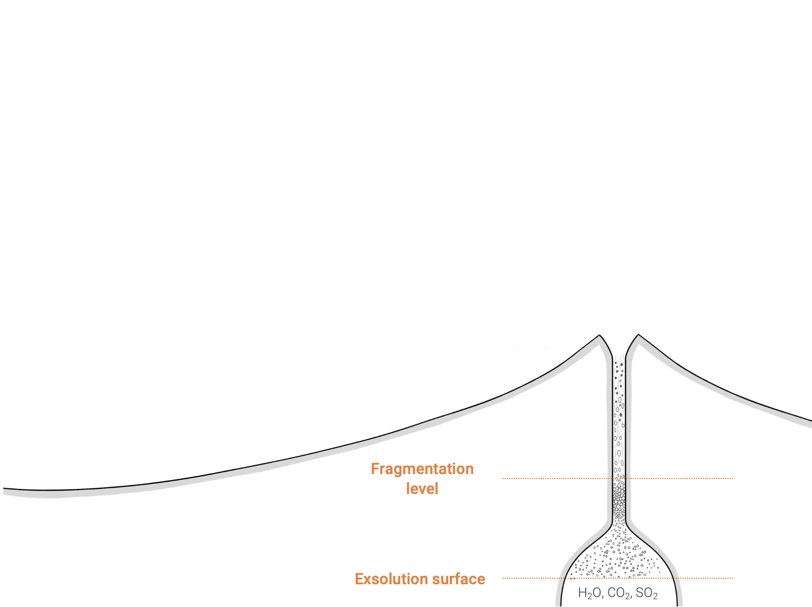
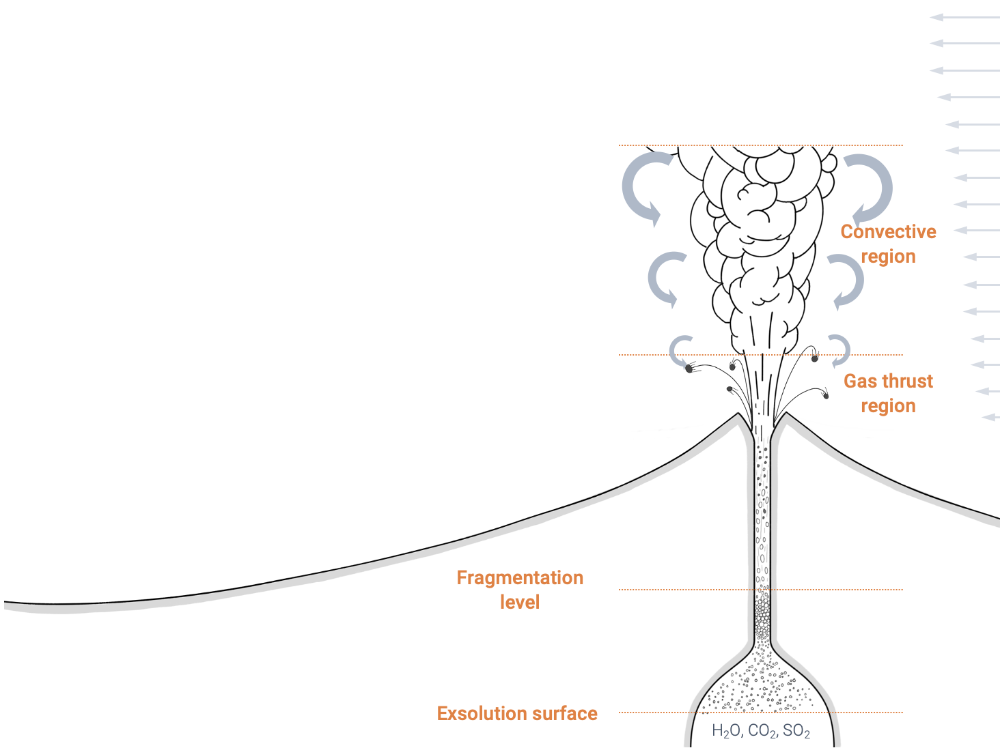

# Probabilistic modelling: Part 2

We have [previously](Hazard_probabilistic1.md) been introduced to probabilistic modeling for lava flows, where we accounted for the uncertainty of vent location on hazard quantification. However, probabilistic hazard assessment strategies have to account for the uncertainty on **more than one** parameter. This section sets the stage for probabilistic assessment of tephra fallout and digs one step further into the mechanics of probabilistic hazard modeling.

## :material-format-list-checks:{ .icn } Objectives

- Understand the concepts of **eruption source parameters** and **eruption scenarios**. 
  
## Probabilistic modeling workflow 

From now on, we will refer to model inputs as **Eruption Source Parameters** - or **ESP**. Probabilistic modeling requires one to:

1. Identify relevant ESPs for a problem.
2. Estimate the uncertainty on each ESP.

## Eruption source parameters 

### Model parametrisation 

A physical model is a **parametrisation** of natural processes, which means that the physics behind a phenomena is described by a set of equations that we could theoretically solve with the right **input parameters**. For instance, **tephra transport and deposition models** requires to describe:

- The generation of volcanic particles.
- The ejection of volcanic pyroclasts in the atmosphere (&rarr; the vertical *column*).
- The dispersal of this material by the wind in the atmosphere (&rarr; the "mushroom" horizontal *plume*).
- The sedimentation of particles onto the ground (&rarr; the tephra *deposit*).

There is no **unique way** of solving this problem. Depending on the **assumptions** behind the physical processes and the **purpose** of the model, the governing equations can be posed in a more or less complex way. 

This slideshow summarises the various steps that tephra transport and deposition models have to solve:

=== "Exolusion" 

    

    - Volatiles (&rarr; gases) dissolved in the magma starts to escape
    - As a result, the liquid magma starts rising in the conduit

=== "Fragmentation"

    

    - The liquid accelerates upwards, the rate of deformation becomes critical and the liquid starts behaving like a solid
    - The magma becomes *brittle* and fragments: it is now a cloud of *solid* (&rarr; pyroclasts) particles surrounded by gas

=== "Convection"

    

    - The material reaches the atmosphere with sufficient momentum to entrain surrounding air
    - The plume becomes *lighter* than the atmosphere and rises from *buoyancy* forces

=== "Wind advection"

    

    - After entraining sufficient air, the plume reaches the same *density* as the atmosphere (&rarr; level of neutral buoyancy)
    - The *umbrella cloud* develops and elongates in the direction of the wind 

=== "Tephra sedimentation"

    

    - Particles are carried horizontally in the umbrella cloud. As it evolves away from the source, it becomes less "strong" and is not able to transport particles 
    - Large particles leave the umbrella cloud first and fall close to the vent, while finer particles are carried farther away, creating the **tephra deposit**

!!! warning "Strong plumes"

    These cartoons assume a **strong plume** with a typical mushroom-shaped morphology. However, keep in mind that other types of **transitional** or **weak** plumes exist. If the vertical rate of ascent of the plume is not sufficiently high, the plume can *collapse* and create **pyrocalstic density currents**.

### Modeling choices

Some models attempt solving all physical processes taking place in time and space. These models are complex and (theoretically) have a higher accuracy. However, their use is often impeded by:

- The large number of input parameters required to solve all the physics.
- The high computational time required to run them.

Alternatively, other models adopt *assumptions* that allows them to simplify some physical processes. Although their (again, theoretical) accuracy is reduced by the fact assumptions replace the actual solving of physical processes, these models:

- Require a much lower number of input parameters, which facilitates their use.
- Are much faster to run as they do not need to solve as many equations.

!!! info "What model is better for hazard assessment?"

    Is a **complex numerical model** always better than a **simpler model** (e.g., empirical or probabilistic)? Well, not necessarily, it all depends on **context**.

    When a high accuracy is required, complex numerical models are generally better. However, they usually require a large number of ESPs and an important computing power. Therefore, they are not suited for probabilistic analyses as their computational time is too large, and they are therefore mostly used for [deterministic](Hazard_probabilistic1.md) modeling. 

    Conversely, simpler models might not capture all the subtleties of the underlying processes, but are easier to use and require less computation cost. Therefore, they can be used for [probabilistic](Hazard_probabilistic1.md) modeling and are often used for long-term hazard assessments. 

The first aspect to identify is **what ESP is critical** for the hazardous phenomenon of interest. For instance, important ESP for tephra accumulation include the plume height, the erupted mass, the mass eruption rate and the grain-size distribution. 

The choice of ESP must be put in context of the **selected model** for hazard assessment. Typically, **complex numerical models** are very **accurate** but require a **large number of ESPs**, which can be difficult to obtain. For instance, `FLOWGO` is a model that simulates lava flows based on the evolution of thermo-rheological properties that requires the identification of tens of different ESPs. Conversely, **simpler models** rely on simpler assumptions, usually require **less ESPs** but typically have a lower accuracy (e.g., `Q-LavHA`).

## Estimate the uncertainty of ESPs 

Probabilistic modeling requires to define ESPs not as **single** but as **distributions** of values, generally defined as:

1. A **range** of values (i.e., the `minimum` and `maximum` values to explore).
2. A **shape** of distribution. 

These two components reflects the **knowledge** that we, as "experts", have of the problem. Figure 4 illustrates 4 types of uncertainty distributions that can be applied to ESPs:

- The **top left** example is a `uniform` distribution: In this case, any value between `min` and `max` has an **equal probability of occurrence**. This is often referred to as a *maximum level of ignorance*. 
- The **top right** example is a `logarithmic` distribution: In this case, we assume that **smaller values** have higher probabilities of occurrence **than larger** ones. For instance, large earthquakes occur more often than small ones. 
- The **bottom left** example is a `gaussian` distribution: Here we assume that **a central value** has the highest probability of occurrence, but it can divert from it in a **symmetrical** fashion.
- Finally, the **bottom right** example represent an unrealistic case where `min`=`max`. This would only occur if there was **no uncertainty**.

<figure markdown>
  { width="600" }
  <figcaption>Figure 4: Various approaches to quantify ESP uncertainties during probabilistic modeling.</figcaption>
</figure>

!!! info "What uncertainty"

    Conceptually, uncertainties can be classified in two categories:

    - **Epistemic uncertainty**  derives from the lack of knowledge regarding a phenomena. In theory, we could reduce epistemic uncertainties if more observations of the phenomena were available to help us better constrain the underlying processes and behaviours.
    - **Aleatoric uncertainty** is associated with the inherent randomness of natural processes. 

    The types of distributions shown in Figure 4 combine both types of uncertainties. Although a better characterisation of the **epistemic** uncertainty would help to refine the *top left* distribution towards a distribution centered on a *best guess* values, the constant presence of an **aleatoric** component of uncertainty is the reason why the *bottom right* distribution is impossible to achieve.

**How do we improve our knowledge of the uncertainties around ESPs?** Ideally, identifying the range of ESPs is based on **extensive field studies**. By reconstructing the **stratigraphy** of a volcanic edifice, we can study its **past eruptive history**, which is then used to estimate the potential future **eruption scenarios**. 

## Various approaches for hazard assessment

### Deterministic scenarios

**Deterministic** hazard assessments: Usually based on past events, they express the hazard should *the exact same event* happen again in the future. As we have seen, this is impossible, and, in the end, this approach fails to account for and quantify uncertainties. However, their benefit is that they are easy to communicate with decision makers. Deterministic scenarios are mostly used for the development of contingency plans in contexts, **only when** a well-established communication channel exists between monitoring agencies, decision-makers and stakeholders. 

### Scenario-based 

### Probabilistic volcanic hazard assessments

Probabilistic volcanic hazard assessments - or **PVHA**