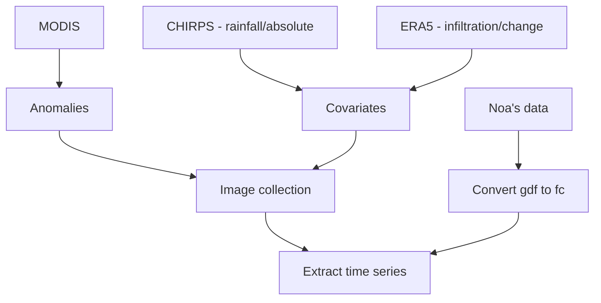

# Welcome to the CERG-C's homepage for Volcanic hazard classes & material

Hi there, and welcome to the [CERG-C](https://www.unige.ch/sciences/terre/CERG-C/)'s homepage for Volcanic hazard classes & material! You will find here a combination of ressources to conduct volcanic hazard and impact assessments as well as teaching material for both Master's and CERG-C classes.

$$
\operatorname{ker} f=\{g\in G:f(g)=e_{H}\}{\mbox{.}}
$$
s